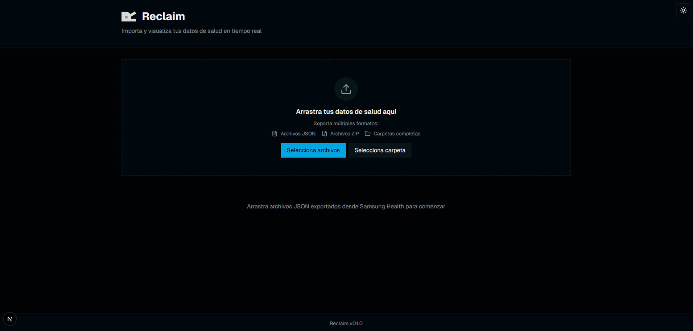

# Reclaim v2.0.0

<div align="center">
  
  <h3>Análisis financiero personal</h3>
  <p>Importa tus datos de MercadoPago y visualiza tus finanzas con gráficos y métricas detalladas</p>
  
  [](./CHANGELOG.md)
  [](./CHANGELOG.md)
  [](./LICENSE)
</div>

## 📱 Vista previa

<div align="center">
  
</div>

## ✨ ¿Qué hace Reclaim?

Reclaim es una plataforma de análisis financiero personal que te ayuda a visualizar y entender tus datos de MercadoPago:

### 🎯 Características principales
- 📊 **Dashboard financiero completo** con métricas en tiempo real
- 📈 **Análisis de tendencias** y patrones de gasto
- 📉 **Gráficos interactivos** de evolución temporal
- 🔍 **Filtros avanzados** por fecha, categoría y monto
- 📁 **Importación múltiple**: JSON, CSV, ZIP y carpetas completas
- 🌓 **Modo oscuro** y diseño responsive
- 📤 **Exportación** de reportes en CSV
- 🔒 **100% privado**: Procesamiento local, sin envío de datos

### 📊 Análisis Financiero
- **Clasificación automática** de transacciones por categorías
- **Resumen mensual** de ingresos y gastos
- **Visualización por categorías** con gráficos
- **Paginación** de transacciones para fácil navegación

## 🚀 Instalación

Necesitas tener Node.js instalado en tu computadora.

```bash
# Descarga el proyecto
git clone https://github.com/tu-usuario/reclaim.git
cd reclaim

# Instala las dependencias
pnpm install

# Ejecuta la aplicación
pnpm dev
```

Abre [http://localhost:3000](http://localhost:3000) en tu navegador.

## 📊 Cómo usar

### 1. Obtén tus datos de MercadoPago

**Método recomendado (datos completos):**
- Ve a [mercadopago.com.ar](https://mercadopago.com.ar)
- Inicia sesión en tu cuenta
- Ve a **Tu perfil** → **Privacidad** → **Solicitar reporte**
- Selecciona **"Tus movimientos de dinero"**
- Espera el email con el archivo ZIP (puede tardar horas/días)
- Extrae el ZIP y busca la carpeta `Movimientos de dinero`

**Método alternativo (datos recientes):**
- Desde la app de MercadoPago → **Configuración** → **Exportar datos**

### 2. Importa en Reclaim

- **Arrastra archivos** JSON, CSV o carpetas completas
- **O haz clic** en "Seleccionar archivos"
- Reclaim procesa automáticamente todos los formatos de MercadoPago

### 3. Explora tus finanzas

- **Dashboard principal**: Métricas generales y saldo
- **Pronósticos**: Predicciones del próximo mes
- **Análisis de gastos**: Tendencias por categoría
- **Alertas**: Notificaciones de gastos inusuales
- **Recomendaciones**: Consejos personalizados

## 🎨 Funcionalidades avanzadas

### 📈 Análisis inteligente
- **Regresión lineal** para detectar tendencias
- **Coeficiente de variación** para medir estabilidad
- **Análisis de percentiles** para identificar outliers
- **Clasificación automática** por tipo de gasto

### 📊 Visualizaciones
- **Gráficos de barras** para comparación mensual
- **Gráficos de líneas** para evolución temporal
- **Distribución por categorías** con pie charts
- **Filtros avanzados** por fecha y categoría

### 🔒 Privacidad y seguridad
- **Procesamiento local**: Tus datos nunca salen de tu dispositivo
- **No requiere cuenta**: Funciona completamente offline
- **Exportación opcional**: Control total sobre tus datos

## 📋 Changelog

Ver [CHANGELOG.md](./CHANGELOG.md) para el historial completo de cambios.

### Versión 2.0.0 - Refactorización Mayor
- 🚀 Build 73% más rápido (74s → 19.7s)
- 📉 31% menos código (3,500 → 2,400 líneas)
- ✅ Arquitectura enterprise-grade
- ✅ Context API + Zod + Interfaces
- ✅ Sin código duplicado ni muerto

## 🤝 Contribuir

Si querés mejorar Reclaim o encontraste un problema:

1. **Issues**: Reporta bugs o solicita features
2. **Pull requests**: Envía mejoras al código
3. **Discusiones**: Comparte ideas para nuevas funcionalidades

### Áreas de mejora sugeridas:
- Soporte para otros bancos (Santander, Galicia, BBVA)
- Sincronización automática con APIs
- Presupuestos personalizables
- Análisis de inversiones
- Integración con otras fuentes de datos

## 📄 Licencia

Este proyecto está bajo la Licencia MIT - ver el archivo [LICENSE](LICENSE) para más detalles.

---

<div align="center">
  <p>🧠 Hecho con IA para potenciar tus finanzas personales</p>
  <p>⭐ Si te gusta Reclaim, ¡dale una estrella en GitHub!</p>
</div>